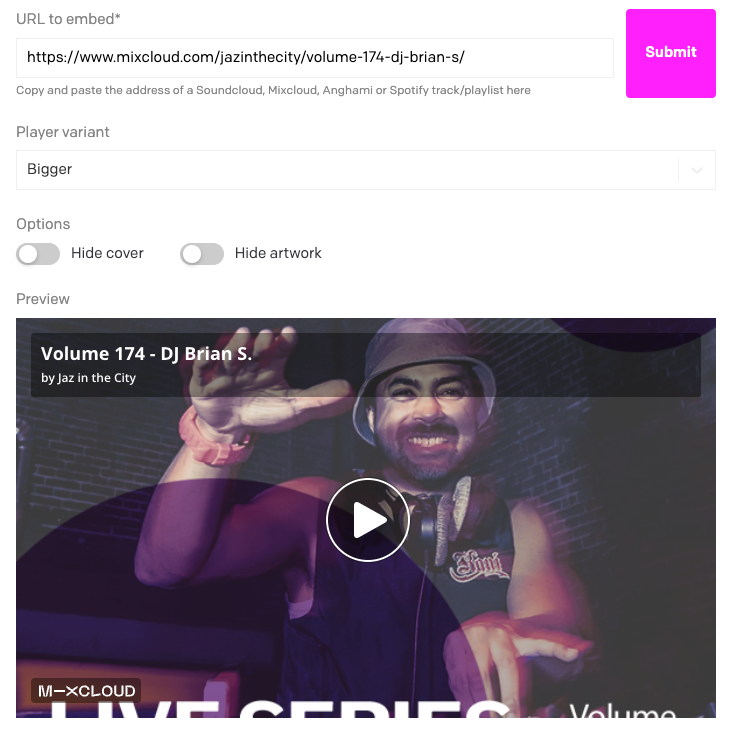

# External Audio Field

[](https://www.datocms.com/marketplace/plugins/i/datocms-plugin-external-audio-field) [](https://www.npmjs.com/package/datocms-plugin-external-audio-field)   [](LICENSE.txt) [](https://www.novemberfive.co/)

A DatoCMS plugin that allows content editors to easily embed [Soundcloud](https://soundcloud.com/), [Mixcloud](https://www.mixcloud.com/), [Spotify](https://www.spotify.com/nl/) and [Anghami](https://www.anghami.com/) tracks and playlists.

Via the [oEmbed](https://oembed.com/) standard we'll fetch the embed and meta data for the track. All the information you select is available via the [Content Delivery Api](https://www.datocms.com/docs/content-delivery-api).

Created By [November Five](https://www.novemberfive.co/)

## Head ups

This package used to be called `dato-cms-external-audio-field-plugin` but was deprecated in favour of the DatoCMS naming convention, the new package name is now `datocms-plugin-external-audio-field`

## Installation

Install the plugin by following the DatoCMS guide: [Installing Marketplace Plugins](https://www.datocms.com/docs/general-concepts/plugins#installing-marketplace-plugins).

**IMPORTANT!!**: At the moment Mixcloud does not have the right CORS settings for their /oEmbed endpoint. To solve the you can provide a proxy url through which this plugin will fetch the embed response. We will try to call it with the full oEmbed url as a `endpoint` query parameter. An example would be

```
[GET] https://yourProxyApiEndpoint.org?endpoint=endpoint=https://www.mixcloud.com/oembed/?url=https://www.mixcloud.com/MDLBEASTRADIO/mdlbeast-mdlbeast-radio-001/&format=json
```

If you want more help on the setup of this proxy you can always react out via the [Issues](https://github.com/novemberfiveco/datocms-plugin-external-audio-field/issues/new)

## Usage

This is a JSON field extension. So you can use by adding a JSON field:

1. On the model/block you want to add the field to click `New field`
2. In the popup modal select the `JSON` button.
3. Give it a sensible name
4. Select the tab `Presentation`
5. In the field editor dropdown select: `External Audio Field`

In the record field you just copy paste and audio url from one of the supported providers (Soundcloud, Mixcloud, Spotify) and configure it the way you want. Each provider has some different players/options which you can select.

You should end up with something like this:



Output:

```json
{
  "oEmbed": {
    "version": 1,
    "type": "rich",
    "provider_name": "SoundCloud",
    "provider_url": "https://soundcloud.com",
    "height": 400,
    "width": "100%",
    "title": "BURN BEAST 001 - DABOUS by MDLBEAST",
    "description": "@waleed-abudabous Is a homegrown Saudi DJ/producer thats been crafting music for five years now and is known for his unique style of mixing various House Music genres ⚡",
    "thumbnail_url": "https://i1.sndcdn.com/artworks-cPivDyutshSD9GQz-wScohg-t500x500.jpg",
    "html": "<iframe width=\"100%\" height=\"160\" scrolling=\"no\" frameborder=\"no\" src=\"https://w.soundcloud.com/player/?height=160&amp;label=Default&amp;show_artwork=true&amp;show_comments=true&amp;url=https%3A%2F%2Fapi.soundcloud.com%2Ftracks%2F1224023323&amp;visual=true\"></iframe>",
    "author_name": "MDLBEAST",
    "author_url": "https://soundcloud.com/mdlbeast"
  },
  "options": {
    "variant": {
      "label": "Default",
      "value": {
        "label": "Default",
        "height": 160
      },
      "defaultToggles": {
        "show_artwork": true,
        "show_comments": false,
        "visual": false
      }
    },
    "toggles": {
      "show_artwork": true,
      "show_comments": true,
      "visual": true
    }
  },
  "url": "https://soundcloud.com/mdlbeast/dabous-1?in=mdlbeast/sets/burn-beast-riyadh-marathon&utm_source=clipboard&utm_medium=text&utm_campaign=social_sharing"
}
```

Do you know some other options that I forgot? Check the [Contributing](https://github.com/novemberfiveco/datocms-plugin-external-audio-field/blob/master/CONTRIBUTING.md) guide on how to make suggestion for improvements of this plugin! Or you can make a PR if you want.

## Contributing

- **Reporting a bug**: [Open an issue](https://github.com/novemberfiveco/datocms-plugin-external-audio-field/issues/new?assignees=&labels=&template=---bug-report.md&title=) explaining your application's setup and the bug you're encountering.

- **Suggesting an improvement**: [Open an issue](https://github.com/novemberfiveco/datocms-plugin-external-audio-field/issues/new?assignees=&labels=&template=---feature-request.md&title=) explaining your improvement or feature so we can discuss and learn more.

- **Submitting code changes**: For small fixes, feel free to [open a pull request](https://github.com/novemberfiveco/datocms-plugin-external-audio-field/pulls) with a description of your changes. For large changes, please first [open an issue](https://github.com/novemberfiveco/datocms-plugin-external-audio-field/issues/new?assignees=&labels=&template=---feature-request.md&title=) so we can discuss if and how the changes should be implemented.

For more information check the [CONTRIBUTING.md](https://github.com/novemberfiveco/datocms-plugin-external-audio-field/blob/master/CONTRIBUTING.md) document.

## License

Copyright (c) [November Five BVBA](https://novemberfive.co). All rights reserved.

Licensed under the [MIT](LICENSE.txt) License.
